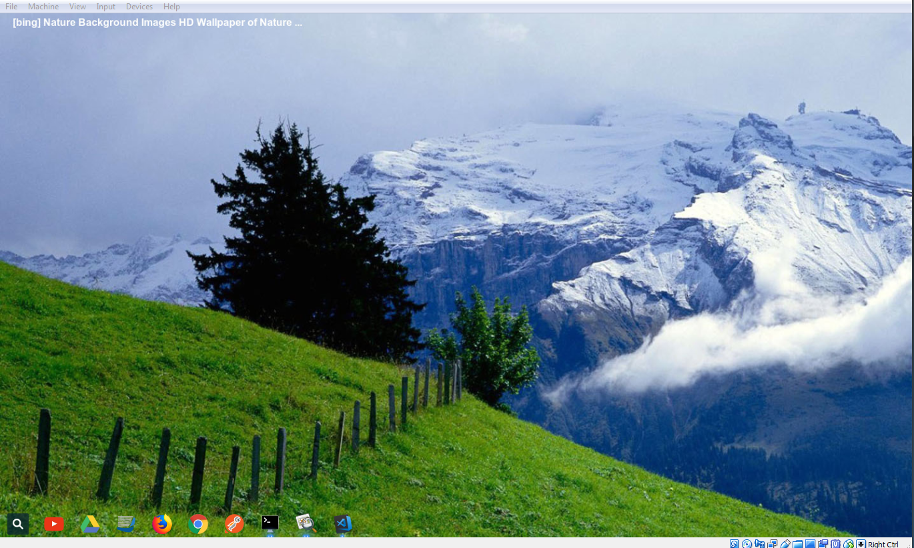
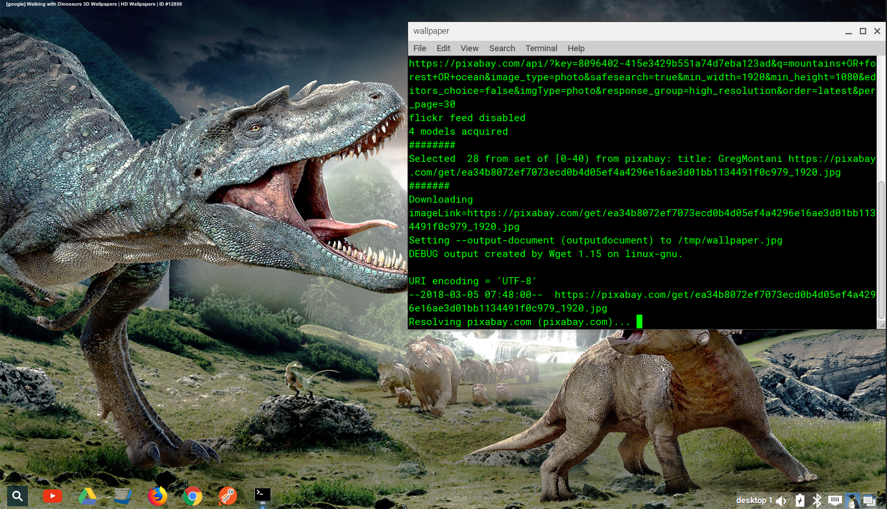
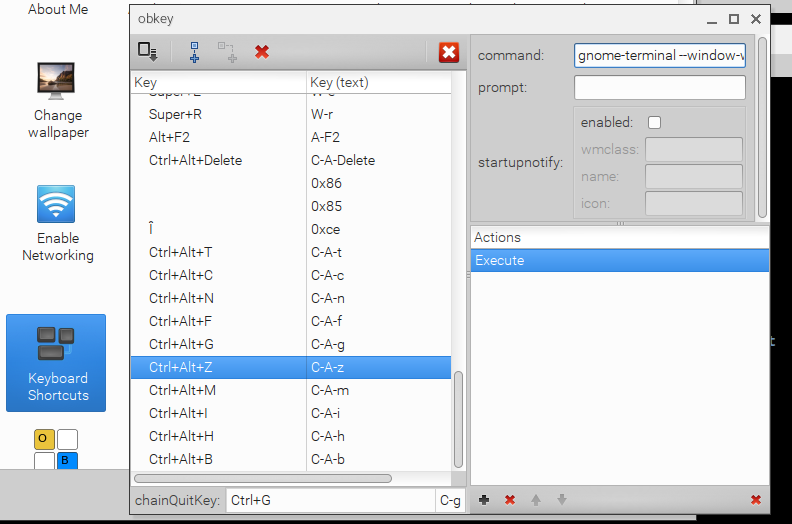

# Installation
This program currently only supports Linux platforms.  It has only been tested with Ubuntu thus far.

## Dependencies
Ensure the following dependencies are installed:
```
$ sudo apt-get install jq image-magick nitrogen wget
```
* jq - JSON parser
* image-magic - Using 'convert' to inject text into image
* nitrogen - set the desktop background to the downloaded image
* wget - download image URL

## Node.js
* Install Node.js
* Export a NODE_HOME variable
```
export NODE_HOME=/path/to/Node.js
```

# Usage Notes
The same three files are created in the /tmp directory each time the shell script (wallpaper.sh) is run.

```
$ ls -l /tmp/wallpaper* /tmp/convert*
-rw-rw-r-- 1 user user 605612 Mar  5 09:05 /tmp/convert.jpg
-rw-rw-r-- 1 user user 557659 Mar  4  2015 /tmp/wallpaper.jpg
-rw-rw-r-- 1 user user    185 Mar  5 09:05 /tmp/wallpaper.json
$ 
```
## Configuration
Modify the lib/config.json file
* Insert your own API keys for [Bing](https://azure.microsoft.com/en-us/pricing/details/cognitive-services/search-api/web/), [Google Custom Search](https://developers.google.com/custom-search/json-api/v1/introduction#identify_your_application_to_google_with_api_key), or [Pixabay](https://pixabay.com/api/docs/)
* Modify the search terms for each provider. (There is no GUI config at this time.)
* The Flickr provider is disabled as their API doesn't seem to support hi-resolution image queries.


# Troubleshooting

## Shell script trace
Uncomment these lines at the top of wallpaper.sh to produce a shell script log
```
#!/bin/bash

# Uncomment to dump to a log file
# exec > /tmp/wallpaper.log 2>&1
#set -x

echo NODE_HOME: $NODE_HOME
echo 'Executing wallpaper.sh'
```

## Node JS logging
Node.js trace logging is available via NODE_DEBUG env variable.
```
$ cd ~/dev/git/usawco/wallpaper
$ NODE_DEBUG=wallpaper,http ./wallpaper.sh
 09:05:08 up 17:12,  4 users,  load average: 0.18, 0.28, 0.45
Done
NODE_HOME: /home/user/dev/tools/nodejs/node-v8.9.4-linux-x64
Executing wallpaper.sh
Mon Mar 5 09:05:08 EST 2018
removing old image
Getting list of images
WALLPAPER 10490: Loading Google config
WALLPAPER 10490: {"providers":{"google":{"enabled":true,Cache-Control: max-age=2592000
.
.
.
Expires: Wed, 04 Apr 2018 14:05:08 GMT
Connection: close
Content-Type: image/jpeg

---response end---
200 OK
Length: 557659 (545K) [image/jpeg]
Saving to: ‘/tmp/wallpaper.jpg’

100%[==================================================================================================>] 557,659      984KB/s   in 0.6s   

Closed fd 4
2018-03-05 09:05:10 (984 KB/s) - ‘/tmp/wallpaper.jpg’ saved [557659/557659]

Setting wallpaper
$ 
```

# Keyboard Shortcut
Add this program to a keyboard shortcut for maximum easy of use. I suggest using gnome-terminal for the terminal popup, so you can monitor its progress. :)


e.g. I've created a bash profile called 'login' in the example below that sets the custom green foreground color.
```
 $ gnome-terminal --window-with-profile=login -e /home/user/dev/git/usawco/wallpaper/wallpaper.sh
```
Tip: Make sure NODE_HOME environment variable is defined.



# dev notes
## Adding another handler
wallpaper.js acts as a controller for a set of handlers (e.g. bing, pixabay, google custom search, flickr).

### Step 1: create a new handler
Use one of the existing handlers as a guide. Be sure to export an 'exec' function in the new handler's module that returns a Promise.

### Step 2: add handler to wallpaper.js
Add the handler to the list of promises defined in wallpaper.js. 
```js
    var entry = null;
    let promises = [                 
        bing.createFeed(),    
        googs.createFeed(),
        pixabay.createFeed(),           
        flicker.createFeed(),            
        // new handler goes here...
    ];
```
### Step 3: add configuration details to config.json
Your config elements may be different for your handler.
For example, here is the bing entry.  You would add a new entry with for your handler.  In this example, I'm returning images with the 'nature' search term. (See config.js for more details.)
```js
        "bing" : {
            "enabled" : true,
            "key" : "xxxxxxxxxxx",            
            "terms" : [ "nature" ],
            "width" : 1920,
            "height" : 1080
    
        },
```
# TODO
1. unit tests with mocking support
2. jsdoc
3. consider a GUI config
