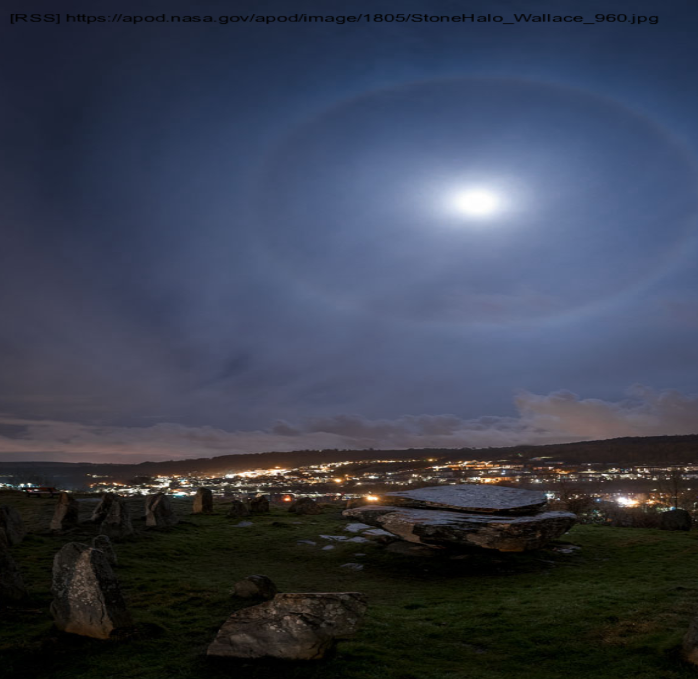

A program for setting randomized background wallpapers in a Linux or Windows desktop.

Each time this program executes, it will select a random image from one of its configured providers to use as a desktop background. When launched from a keyboard shortcut, it provides a very simple yet effective method for changing your wallpaper. 

The following providers are supported:

* Google custom search
* Bing image search
* Pixabay image search
* Flickr (low-res requires no api key)
* Flickr hi-res
* Local json file of favorites' (See ~/desktop-eye-candy/favorites.json)
* Local directory handler
* Generic RSS feed handler


# Revision history
| when          | what   |
| ------------- | :------|
| 4.4.3   | Enhanced RSS feed handler. ( See  [RSS handler](#rss) for more details.)
| 4.3.2   | Bugfix localFS handler ( switch file copy method to something more reliable for windows) |
| 4.3.0   | socket timeout added to configuration |
| 4.2.1   | Improved randomizer to be equally fair across set of handlers
| 4.1.0   | Support for a generic RSS xml feed handler with help from [xml2js](https://www.npmjs.com/package/xml2js) |
| 4.0.3   | Clarify installation step (i.e. [Semantic Versioning](https://docs.npmjs.com/getting-started/semantic-versioning)) |
| 4.0.2   | 'Favorites' redesign (See [Providers](#providers) for more details and 'fav' action supported on API.
| 3.3.4   | Need to pass the full directory path (including drive letter) for later windows 10 builds.
| 3.3.3   | add '/tmp' directory to the config, so it can be overridden and create directory if it doesn't exist.
| 3.3.1    | Switched to proper [win32 API](https://msdn.microsoft.com/en-us/library/windows/desktop/ms724947(v=vs.85).aspx) call for reliably setting desktop for Windows |
| 3.2.3    | bugfix for local file favorites with older node.js |
| 3.2.2    | flickr hi-res handler supported
| 3.1.4    | Switched to [jimp](https://www.npmjs.com/package/jimp) node package for text annotation. (pixabay handler supported for windows now) |
| 3.0.4    | Significant update to support upcoming GUI, image urls with 301 redirects now supported, improved error messages |
| 2.0.10   | Switched to node.js http module
| 2.0.8   | Windows support (Requires Powershell)|
| 1.3.12  | Bugfix when install creates initial config.json
| 1.3.11  | An existing configuration is no longer overwritten. config.json moves to ~/.desktop-eye-candy/config.json | 
| 1.2.3  | A 'favorites' provider introduced, source code cleanup (eslint) |
| 1.1.3  | Update README for 17.10 support |
| 1.1.1  | Support global module installation |
| 1.0.7  | Initial release |
 
# Coming soon
* UI support (via Visual Studio for Code extension)
* detect resolution at install-time

# Package Installer

How to install this release.

## Upgrading

If you've already installed an earlier version of desktop-eye-candy, you may use npm to upgrade the package.

```
npm upgrade -g desktop-eye-candy
```
> Note: upgrade will only update to the latest version of your currently installation major release. If you are at 3.0.0, it will not update to 4.x.  

To upgrade to the very latest version...
```
npm uninstall -g desktop-eye-candy
followed by
npm install -g desktop-eye-candy
```
> Uninstallation does not remove the contents of ~/.desktop-eye-candy, so you configuration will be preserved.

Depending upon your version, an additional step is required.

### [1.3.8 - 3.0.0)

Prior to 3.0.0, the app was launched from OS scripts ( e.g. wallpaper.sh and wallpaper.bat ). This has been changed to 
invoke bin/wallpaper.js.

> Note, npm still creates a symbolic link to a 'wallpaper' command on that environment path; however, the command syntax is now different. 
> 'wallpaper exec' is the new syntax. Please see [Command Syntax](#cli-syntax) for more details.

### [1.0.7 - 1.3.8)

The existing configuration elements are no longer overwritten. Each time an update is applied, any new elements introduced into the source template lib/config.js file are added to your configuration (~/desktop-eye-candy/config.json) . Elements are never deleted or overwritten.

Copy your existing config.json file to ~/desktop-eye-candy/config.json before running npm -g update desktop-eye-candy. This manual step is only required one time since future updates will look for the configuration file in its new location.


## Installation

If installing for the first time...

## Download from npm Registry
If this is the first download, perform a  global install, so 'wallpaper' is accessible on your PATH.
```
npm install -g desktop-eye-candy
```

## Specify imagePath
> For Windows, you MUST specify the drive letter too. 'Drive 'C:' is the default post-installation added automatically.
e.g.
```
 "imagePathDirectory" : "c:/tmp",
```
## Post Install/Upgrade Setup

After the package is installed or updated, a script runs to complete the post-installation setup.
* Create an app home directory under ~/.desktop-eye-candy
* Install ~/.desktop-eye-candy/images  - i.e. the default local file store for the localFS provider)
* Install ~/.desktop-eye-candy/favorites.json containing favorite URLs for the favorites provider


## Create API keys
Most of the supported providers ( [Bing](https://azure.microsoft.com/en-us/pricing/details/cognitive-services/search-api/web/), [Google Custom Search](https://developers.google.com/custom-search/json-api/v1/introduction#identify_your_application_to_google_with_api_key), [Flickr HiRes](https://www.flickr.com/services/api/) and [Pixabay](https://pixabay.com/api/docs/) ) require an authorized API key. Moreover, for Pixabay, one must send an email requesting access to high-resolution images as discussed in their API docs. The Flickr provider requires no API key; however, it is disabled by default.

## Configure
Configure one of the supported providers by editing '~/.desktop-eye-candy/config.json'. You will want to install API keys and search terms.

## Command Syntax <a id="cli-syntax"></a>

To generate a random image and set it to the desktop backgroud, run this command.
```
wallpaper exec
```

The following options are supported.

| command     | Notes |
| ----------- | ----- |
| wallpaper -h | Help doc | 
| wallpaper exec | Create a random image and set it on the desktop background.  The image should be immediately visible |
| wallpaper gen | Create a new random image only. The /tmp/wallpaper.jps and /tmp/wallpaper.json files are created |
| wallpaper set | Set the last desktop background using the last created image.
| wallpaper get | Return the JSON string for /tmp/wallpaper.json |
| wallpaper fav | Create an entry in the ~/.desktop-eye-candy/favorites folder for the currently selected desktop image

> Note, 'wallpaper exec' and 'wallpaper gen && wallpaper set' are functionally equivalent.

# Testing Details
The following platforms have been tested thus far.

| OS            | Notes  |
| ------------- | :------|
| Ubuntu 14.04  | None   |
| Ubuntu 16.04  | After installation and configuration, logout and log back in if using keyboard shortcut.|
| Ubuntu 17.10  | None   |
| Windows 10 Home Edition (1709)   | None|


## Dependencies
Ensure the following dependencies are installed:

### Linux
```
$ sudo apt-get install nitrogen
```
* nitrogen - set the desktop background to the downloaded image

### Windows
* Powershell

## Node.js
Install Node.js

### Linux
* Install Node.js
* Export a NODE_HOME variable
```
export NODE_HOME=/path/to/Node.js
```
Note: The simplest approach is to add NODE_HOME to /etc/environment.

e.g. 
/etc/environment
```
NODE_HOME=/home/user/dev/node-v9.7.1-linux-x64
PATH="/usr/local/sbin:/usr/local/bin:/usr/sbin:/usr/bin:/sbin:/bin:/usr/games:/usr/local/games"
user@zfs-VirtualBox:~/dev/git/usawco$ 

```

### Windows
* Create NODE_HOME environment variable
* Add %NODE_HOME% to the PATH variable

> Or use the Node.js .msi installer

# Usage Notes
The same two files are created in the configured imagePathDirectory each time 'wallpaper exec' or 'wallpaper gen' is run.

e.g.
```
$ ls -l /tmp/wallpaper*
-rw-rw-r-- 1 user user 557659 Mar  4  2015 /tmp/wallpaper.jpg
-rw-rw-r-- 1 user user    185 Mar  5 09:05 /tmp/wallpaper.json
$ 
```

## Image Provider Notes <a id="providers"></a>

This section provides more information regarding the delivered set of image providers.

Desktop-eye-candy randomly selects images from several sources. Each source is described as a  'provider'. The rest of this section describes information for each of the available providers.

### Local File System Provider
This was originally described as a 'favorites' provider feature before 4.0.x; however, it is now renamed as the 'Local file system provider'. This provider contains a list of local
directory paths containing image files. By default, there always exists one implicitly defined directory path to ~/.desktop-eye-candy/images

### Favorites Provider
This provider contains a list of URLs stored in a JSON formatted file in the app's home directory. New entries may be added to the favorites via the 'fav'
command. It's purpose is to bookmark a set of the random entries deemed 'favorites'.  The file may be found here: ~/.desktop-eye-candy/favorites.json

### Google Custom Search

### Bing

### Flickr LoRes

### Pixabay

### Flickr HiRes

### RSS Feed <a id="rss"></a>



This provider will accept an array of URLs that return raw [RSS](https://en.wikipedia.org/wiki/RSS) feeds in XML format. desktop-eye-candy uses [xml2js](https://www.npmjs.com/package/xml2js) to parse the XML response into a JSON object.

Two approaches are used to gather images based upon how the handler is configured.

If a 'location' is provided, the handler will search all elements of the RSS response anywhere they exist under each 'item' element looking for a 'location' name match. If no URL is found, the item element is dumped when [trace logging](#traceLogging) is enabled. 


If 'searchLinks' is true, each HTML response to the URL defined in each item's 'link' element is examined looking for '' tags. 

## Configuration
Modify the ~/.desktop-eye-candy/config.json file
* Verify the imagePathDirectory setting.  (Windows must include the drive letter. e.g. C:/tmp )
* Insert your own API keys for [Bing](https://azure.microsoft.com/en-us/pricing/details/cognitive-services/search-api/web/), [Google Custom Search](https://developers.google.com/custom-search/json-api/v1/introduction#identify_your_application_to_google_with_api_key), [Flickr API](https://www.flickr.com/services/api/) or [Pixabay](https://pixabay.com/api/docs/)
* Modify the search terms for each provider. (There is no GUI config at this time.)
* Change the provider's 'enabled' key value from false to true.


# Troubleshooting 

## Node JS logging <a id="traceLogging"></a>
Node.js trace logging is available via NODE_DEBUG env variable.

### Linux
```
$ NODE_DEBUG=wallpaper wallpaper exec
Resolving configuration from /home/user/.desktop-eye-candy/config.json
WALLPAPER 12183: Loading Favorites handler config
WALLPAPER 12183: {"enabled":false,"desc":"List of favorite images","feeds":["favorites/"]}
WALLPAPER 12183: Loading flickr config
WALLPAPER 12183: {"enabled":false,"terms":["mountains","puppies"],"desc":"Flickr low resolution images (No key required)"}
WALLPAPER 12183: Loading Google config
.
.
.
Expires: Wed, 04 Apr 2018 14:05:08 GMT
Connection: close
Content-Type: image/jpeg

---response end---
200 OK
Length: 557659 (545K) [image/jpeg]
Saving to: ‘/tmp/wallpaper.jpg’

100%[==================================================================================================>] 557,659      984KB/s   in 0.6s   

Closed fd 4
2018-03-05 09:05:10 (984 KB/s) - ‘/tmp/wallpaper.jpg’ saved [557659/557659]

Setting wallpaper
$ 
```

### Windows

```
C:\>set NODE_DEBUG=wallpaper

C:\>wallpaper
Resolving configuration from C:\Users\user\.desktop-eye-candy\config.json
WALLPAPER 6824: Loading Favorites handler config
WALLPAPER 6824: {"enabled":true,"desc":"List of favorite images","feeds":["favorites/"]}
WALLPAPER 6824: Loading flickr config
.
.
.
```

# Keyboard Shortcut
Add this program to a keyboard shortcut for maximum ease of use. 

## Linux

I suggest using gnome-terminal for the terminal popup, so you can monitor its progress since some images may take a few seconds to download.


e.g. I've created a bash profile called 'login' in the example below that sets the custom green foreground color.

```
$ gnome-terminal --window-with-profile=login -e /home/user/desktop-eye-candy.sh
```
```
 user@user-VirtualBox:~/dev/git/usawco/wallpaper$ cat ~/desktop-eye-candy.sh 
#!/bin/bash
NODE_DEBUG=wallpaper wallpaper exec 
```


## Windows
Create a Shortcut and assign a keyboard mnemonic 
```
Start in: %APPDATA%\npm
Target: C:\WINDOWS\system32\cmd.exe /c wallpaper exec
```

# dev notes
## Adding another handler
wallpaper.js acts as a controller for a set of handlers (e.g. bing, pixabay, google custom search, flickr).

### Step 1: create a new handler
Use one of the existing handlers as a guide. Be sure to export an 'exec' function in the new handler's module that returns a Promise.

### Step 2: add handler to wallpaper.js
Add the handler to the list of promises defined in wallpaper-controller.js. 
```js
    var entry = null;
    let theHandlers = [];
    if ( config.providers.favorites.enabled) theHandlers.push(favorites);
    if ( config.providers.localFS.enabled) theHandlers.push(localFS);
    if ( config.providers.bing.enabled) theHandlers.push(bing);
    if ( config.providers.google.enabled) theHandlers.push(googs);        
    .
    .
    .
        // new handler goes here...
    ];
```
### Step 3: add configuration details to config.json
Your config elements may be different for your handler.
For example, here is the bing entry.  You would add a new entry with for your handler.  In this example, I'm returning images with the 'nature' search term. (See config.js for more details.)
```js
        "bing" : {
            "enabled" : true,
            "key" : "xxxxxxxxxxx",            
            "terms" : [ "nature" ],
            "width" : 1920,
            "height" : 1080
    
        },
```

# TODO
1. unit tests with mocking support
2. consider a GUI config
3. Pop a 'tile preview' panel containing a subset of the random entries. User clicks on a tile to select it. 
